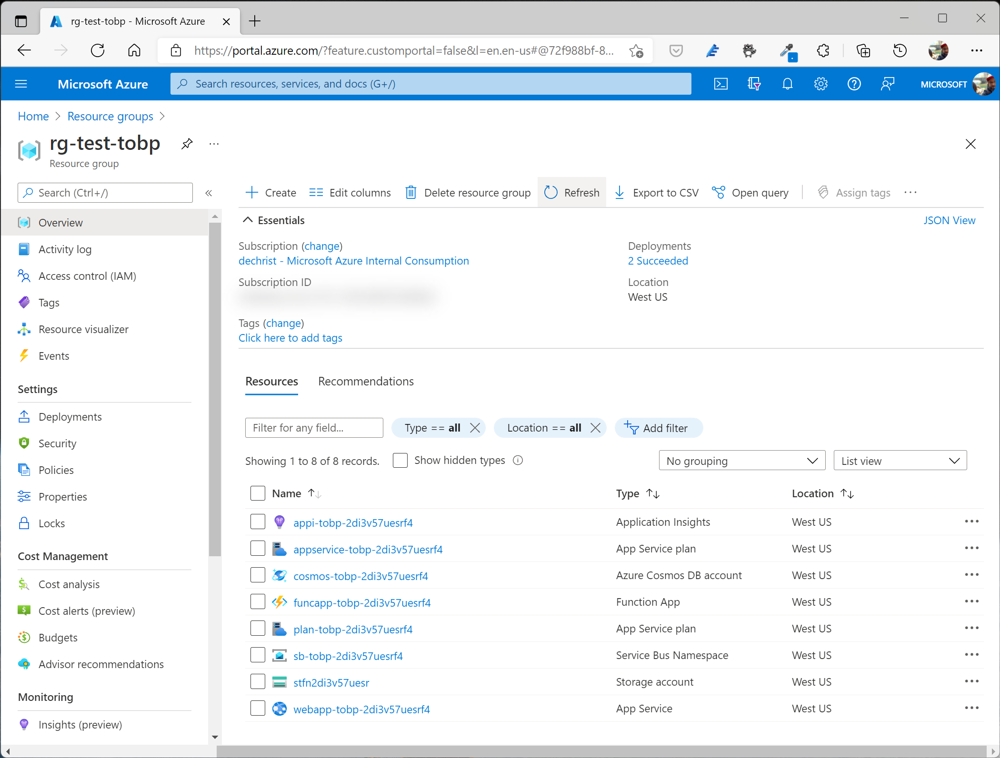
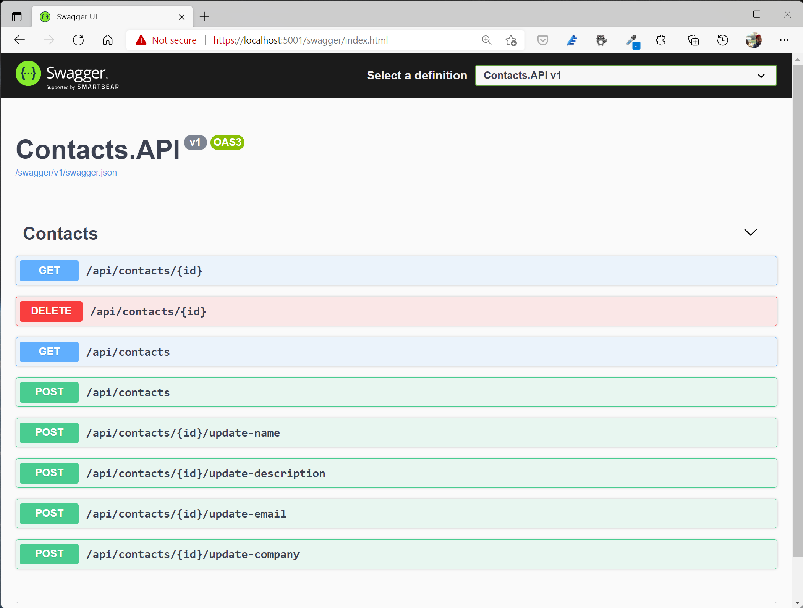
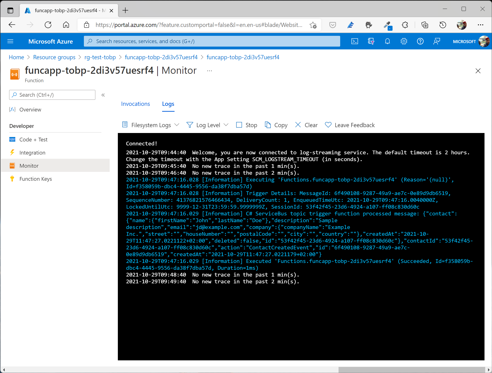

# Sample implementation of the Transactional Outbox Pattern with Cosmos DB

_You'll find a comprehensive blog post about how to implement the pattern step-by-step [HERE](https://partlycloudy.blog/?p=2849)._

This sample application consists of a "Contacts" API and an event processor that reads a Cosmos DB Change Feed and publishes domain events to an Azure Service Bus. The sample demonstrates how to use the **Transactional Outbox Pattern** in combination with **Azure Cosmos DB** to implement **reliable/guaranteed messaging** in your microservice-oriented application.

Source code is structured as follows:

- **Contacts.Domain** - Contact Domain logic and interfaces
- **Contacts.Infrastructure** - Implementation of domain interfaces like repositories
- **Contacts.Application** - Implementation of CQRS pattern using MediatR library, validation and mapping logic
- **Contacts.API** - RESTful API consuming application logic components
- **Contacts.EventsProcessor** - Console application using the Change Feed Processor library to read the Cosmos DB change feed and publish domain events to Azure Service Bus 

In order to run the sample application, you need to create some Azure Resources:

- Azure Cosmos DB
- Azure Service Bus
- Azure Function (to test event distribution via Service Bus - acts as a subscriber)

You can find a bicep file that will take care of creating these resources (and their dependencies) under [Deployment/deploy.bicep](Deployment/deploy.bicep).

To run the deployment script, open a Powershell or Bash prompt **in the `Deployment` folder** an run:

```shell
az group create -n rg-transact-ob -l westeurope

az deployment group create -f deploy.bicep -g rg-transact-ob -o none

az deployment group show -g rg-transact-ob -n deploy --query properties.outputs
```

The last command will output the relevant parameters that you need to adjust in:

- [Contacts.API/appsettings.json](Contacts.API/appsettings.json)
- [Contacts.EventsProcessor/appsettings.json](Contacts.EventsProcessor/appsettings.json)

Your Azure resource group should look like this:



After adjusting the appsettings parameters, you can run the `Contacts.API` and `Contacts.EventProcessor` applications.

To test the implementation, open a browser at https://localhost:5001/swagger/index.html (providing the Swagger UI) and the monitoring view of the pre-deployed Azure Function. 



As soon as you add or update contacts, you'll see events being published to the Azure ServiceBus topic and picked up by the Azure Function.




